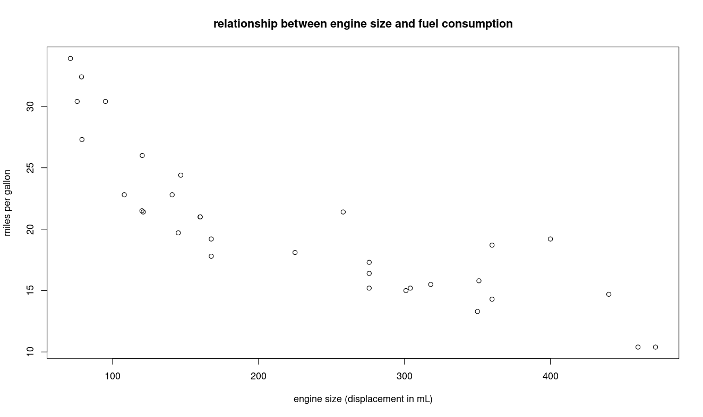

This section describes how to add x-axis labels, Y-axis labels, and titles to your graphs, and colors.   This is critical for making your charts readable and professional.  To add labels, you can apply three parameters to any of the common R graphing functions:

* xlab - stands for X-axis label
* ylab - stands for Y-axis label
* main - graph title on top

For example, here's a scatterplot done with the built-in mtcars dataset:

> plot(mtcars$disp, mtcars$mpg, 
+   main="relationship between engine size and fuel consumption",
+   xlab="engine size (displacement in mL)",
+   ylab="miles per gallon")

And here's what we get:

