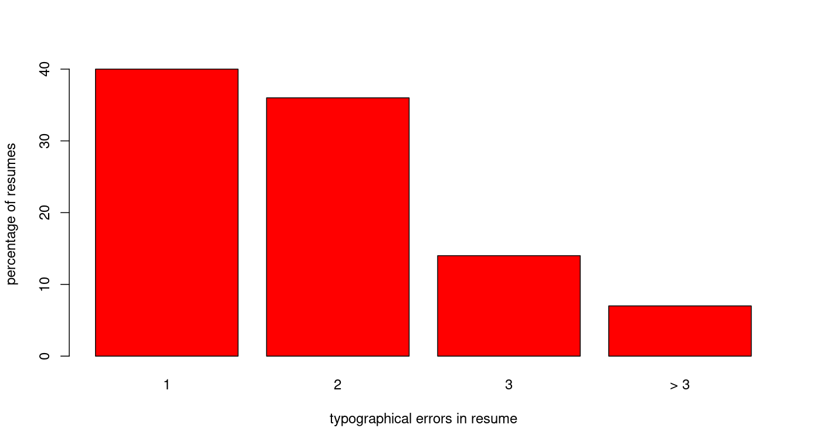
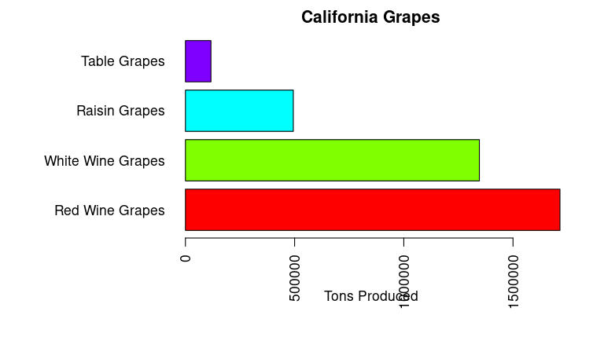
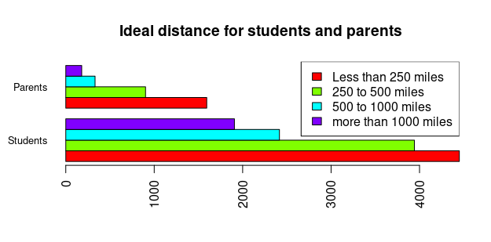
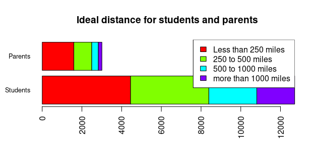

# How to generate bar charts in R

You need to have labels for the different bars in the bar chart.   These go in the `names.arg` optional parameter.

To see how to generate bar charts for frequency tables, see [frequency_tables.md](frequency_tables.md)

# simplest bar chart

Using example 3.3 from the textbook, we create a table showing different levels of typographical errors in resumes:

```

typos = data.frame(level=c('1', '2', '3', '> 3'), relfreq=c(.4, .36, .14, .07))
typos$relfreqpct = typos$relfreq * 100
barplot(typos$relfreqpct, 
  names.arg=typos$level, 
  col='red', 
  xlab='typographical errors in resume', 
  ylab='percentage of resumes')
  
```

and this looks like:




# textual bar labels, single set of bar lengths

In order to use textual labels for each bar, we have to use horizontal bars, in order to leave enough space on the left for names or descriptive text.  We must make the bars small enough that there is room for text on the left.   For example, with the dataset from [example 3.6](https://raw.githubusercontent.com/bengland2/une-stats/main/MAT150/data_sets/ex3_6.txt), this can be done with something like:

```

barplot( 
  ex3_6$Tons.Produced,
  names.arg = ex3_6$Type.of.Grape,
  horiz=TRUE,
  las=2,
  cex.names=0.5,
  xlab="Tons Produced", 
  main="California Grapes", 
  col=rainbow(length(ex3_6$Tons.Produced)))

```
These parameters are described in documentation:

* the first (required) parameter provides the relative length of each bar
* `names.arg` provides the textual labels for each bar
* `horiz` - when set to TRUE instead of default of FALSE, it makes the bars horizontal instead of vertical (the default)
* `las=2` rotates the make and model to be horizontal to go with the horizontal bars
* `cex.names=0.5` squeezes down the size of the row names so that each fits within the width of a bar - default is 1.0 and you may have to adjust down or up to fit.
* we add the usual parameters for axis labels, title and color [described elsewhere](axis_labels_and_title.md)

The result looks like this:



# example 3.1, comparative bar chart

First we have to load the example data set in the right format to generate the bar graph.  Start with the data frame in example 3.1.   Then we convert it to a matrix format that is understood by the `barplot` function.  So we have to:

- make a new data frame containing the raw frequency counts
- compute relative frequencies from raw counts
- include labels for the bars
- subset the original data frame to contain just the labels and relative frequencies
- convert it to matrix form that barplot understands
- insert the labels into matrix as row names

```

> ex31 = data.frame(StudentCount=c(4450,3942,2416,1907), ParentCount=c(1594, 902, 331, 180))
> ex31$Students = ex31$StudentCount / sum(ex31$StudentCount)
> ex31$Parents = ex31$ParentCount / sum(ex31$ParentCount)
> ex31$IdealDistance = c('Less than 250 miles', '250 to 500 miles', '500 to 1000 miles', 'greater than 1000 miles')
> data = as.matrix(data.frame(Students=ex31$Students, Parents=ex31$Parents))
> rownames(data) = ex31$IdealDistance
> data
                         Students    Parents
Less than 250 miles     0.3499803 0.53009644
250 to 500 miles        0.3100275 0.29996674
500 to 1000 miles       0.1900118 0.11007649
greater than 1000 miles 0.1499803 0.05986033

```

Now the matrix has all the raw data needed to produce the bar graph.

```

> barplot(data, 
    las=2, 
    cex.names=0.8, 
    main='Differences in ideal distance for students and parents', 
    col=rainbow(length(ex31$Students)), 
    horiz=TRUE,
    beside=TRUE)
> legend("topright", 
    legend=ex31$IdealDistance, 
    fill=rainbow(length(ex31$Students)))

```
And you get:



You can also generate a stacked bar chart from the same data by removing `beside=TRUE` optional argument:



For additional help with generating barplots, [click on this link](https://r-coder.com/barplot-r/#Grouped_barplot_in_R)
