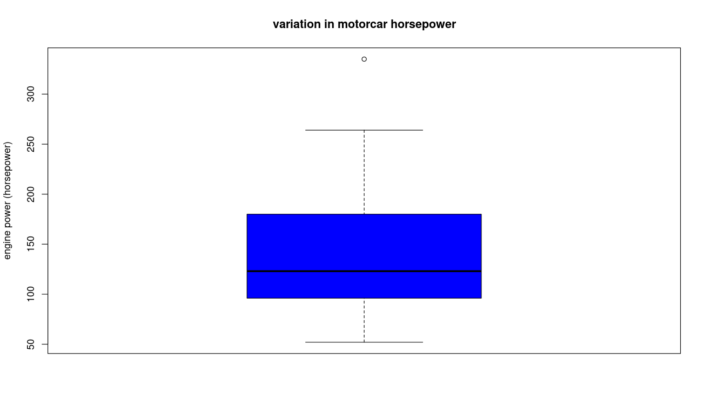

A boxplot graph summarizes the mean, standard deviation, interquartile range, and outliers for a sample.  This is a good way to visually compare several different samples.  For example, using the mtcars dataset, if you want to generate a simple boxplot of a single variable, in this case `hp`:

```

boxplot(mtcars$hp, 
  main='variation in motorcar horsepower', 
  ylab='engine power (horsepower)', 
  col="blue")

```
And we get:



