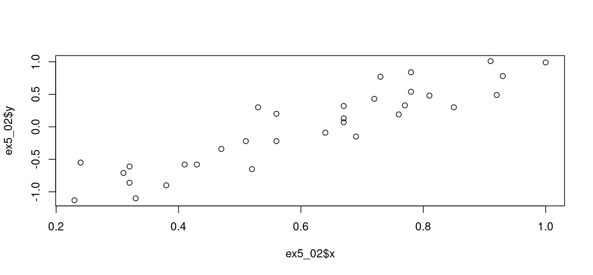

Correlations are calculated in R using two principal functions, *cor()* and *cor.test()*.   The latter provides more details on the statistical outcome of the test, specifically a p-value, whereas cor() only provides the value of *r*, the correlation (between -1 and 1).

The simplest way is to provide two lists of numbers, like this example.  The left angle brackets in column 1 are prompts from the R interpreter.

```
> r = cor( c(1,2,3), c(1,2,3) )
> r
[1] 1
```

So here we see that the highest possible correlation score is achieved between a list of numbers and itself, as you would expect.  In the next example, we try to get the lowest possible correlation (strongest negative correlation).

```
> r = cor( c(1,2,3), c(3,2,1) )
> r
[1] -1
```

These two lists, (3,2,1) and (1,2,3), are perfectly negatively correlated - one goes up linearly as the other one goes down.   So we get the most negative possible correlation of -1.

So what happens if we add 3 to the 2nd list and multiply it by 2?  

```
> r = cor( c(1,2,3), c(12, 10, 8) )
> r
[1] -1
```

There is no effect!   This is why correlation is so useful - it is not affected by linear transformations (addition of, or multiplication by, a constant).

# Determining if correlation exists

Import the attached dataset from Example 5.2 in your textbook page 216 to R Studio.   You can get it from ex5_02.txt in this directory. After importing, you should see 2 columns, x and y.    You can generate a scatterplot as follows:

```
attach(ex5_2)
plot(x, y)
```

The *attach()* function allows you to reference the column names in a data frame without specifying the data frame name each time.

The *plot()* function, when given 2 R vectors (number lists), assumes that you want a scatterplot.  The scatterplot looks like this:



The y values do appear to move up as X increases, suggesting a positive correlation.  Compute correlation using cor.test to get additional information relevant to deciding whether or not a correlation exists or not:

```
> attach(ex5_02)
> 
> cor.test(x, y)

	Pearson's product-moment correlation

data:  x and y
t = 12.478, df = 30, p-value = 2.089e-13
alternative hypothesis: true correlation is not equal to 0
95 percent confidence interval:
 0.8329187 0.9583685
sample estimates:
      cor 
0.9156709 
```

The data frame that we are importing is named ex5_02.   when we do "attach" on this data frame, we can now reference the columns in the data frame using just the column name.  For example we can use *x* instead of *ex5_02$x*.

The last number is the correlation result.   What's interesting is the p-value up above, which is very low.   That means there is a vanishing chance that a random set of values could have caused such a correlation, so the correlation exists.   Specifically, for a 95% confidence level, our alpha is 0.05  .   Since the p-value is way below 0.05, we have strong evidence that the null hypothesis (no correlation) is not likely, so the alternative hypothesis (that there is correlation) is very likely.  This p-value is computed under the assumption that the 2 variables *x* and *y* have a normal distribution.
