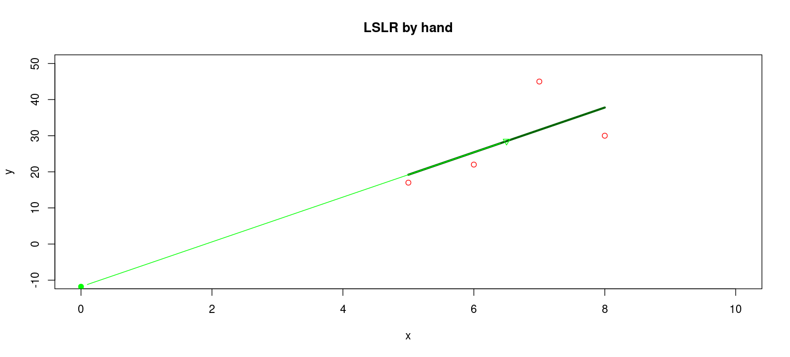

# how R can do least-squares linear regression

Normally you will use the R library function `lm()` to do Least-Squares Linear Regression (LSLR).  However, in this example, we show how easy it is to do least-squares linear regression (LSLR) in the R language without even using the built-in function for LSLR, lm().  As you do this, use R studio's upper right pane to monitor the contents of variables to watch the calculation happen.

First, enter a pair of R "vectors" (lists of numbers), assign them to variables x and y.  The lists must be the same length, so what we really are entering are ordered pairs, (x,y) values.  Normally, you would use columns within an R data frame for this, and the below calculation would work whether there were 4 or 4,000 values in the columns.

```

> x = c(5,6,7,8)
> y = c(17,22,45,30)

```
Now calculate difference from the mean for each sample value

```

> x_minus_mean = x - mean(x)
> y_minus_mean = y - mean(y)
> x_minus_mean_sqr = x_minus_mean * x_minus_mean

```

Note that `x_minus_mean` is difference of a vector and a scalar (single number).   Most programming languages would not let you do this, but R infers that you want to multiply each vector element by the scalar and does this for you *without any loop*.

```

> y_minus_mean_sqr = y_minus_mean * y_minus_mean
> numerator_terms = (x - mean(x)) * (y - mean(y))

```

Note that R just multiplied 2 vectors together by multiplying corresponding elements of each vector and assigning that to the same element of a new vector.  No loop is required.  To calculate the line slope and intercept:

```

> b = sum(numerator_terms) / sum(x_minus_mean_sqr)
> a = mean(y) - (b * mean(x))

```

The predictions for y values for all x values is based on this line

```

> y_hat = b * x + a

```

The residuals (difference between predicted and actual y value) for all data points and squares of residuals

```

> res = y - y_hat
> res_sqr = res * res

```

To calculate r^2, coefficient of determination, and standard deviation from least-squares line:

```

> ssto = sum(y_minus_mean_sqr)
> ssresid = sum(res_sqr)
> r2 = 1 - (ssresid/ssto)
> se = sqrt(ssresid/(length(x)-2))

```
finally we draw a scatterplot with the data points with LSLR line overlaid:

```

> plot(x, y, main="ben.2 LSLR", col="red", xlim=c(0, 10), ylim=c(-10, 50))
> lines(x, y_hat, col="green", lwd=5)
> lines(c(0, mean(x)), c(a, mean(y)), y_hat, col='green', lwd=1, type='b' )

```
We control the X and Y axis limits in the `plot` call so that the Y-intercept of the LSLR can be seen. 
The first call to `lines()` draws the LSLR line itself.   
The second call to `lines` connects the LSLR line to the Y-intercept.
The result should look like:



You may ask: did it really work?  So let's compare above results with a call to R's `lm()` function that does the same task:

```

> lmout = lm(y ~ x)
> lmout

Call:
lm(formula = y ~ x)

Coefficients:
(Intercept)            x  
      -11.8          6.2  

```
As you can see, the slope and intercept values are identical.
