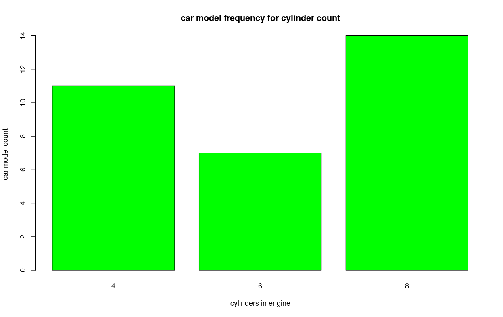
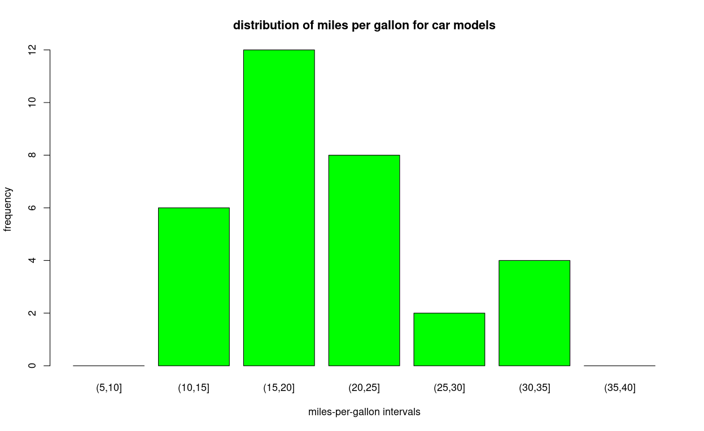
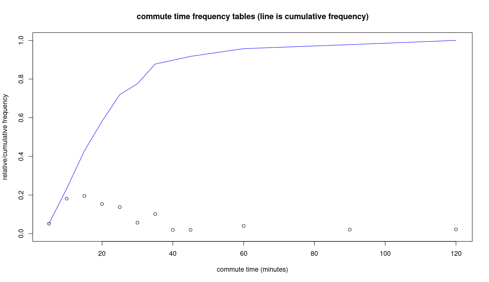

We can generate relative frequency tables from any R data frame column where all the sample elements are counted in exactly 1 row.   
In other words, the column is classifying each sample value into some category and adding it to that category's count.   You install this package to get the count() function:

```
install.packages("dplyr")
library(dplyr)
```

We'll start out using the built-in mtcars data frame.  To generate the raw frequency counts for a column:  

```
cylcount = count(mtcars, cyl)
cylcount
  cyl  n
1   4 11
2   6  7
3   8 14
```

The first column of this frequency table is just a row number.  The second column shows the number of cylinders, and the 3rd column shows the number of car models with that number of cylinders in the engine.    To graph this, we can just use:

```

barplot(cylcount$n, 
  names.arg=cylcount$cyl, 
  main='car model frequency for cylinder count', 
  xlab='cylinders in engine', 
  ylab='car model count', 
  col="green")

```

and you get something like this:




# non-default intervals

If your problem requires that you use specific intervals, perhaps non-uniform, then use this method.   In the above example suppose we want to break diabetes patients into groups of 10 years and generate a relative frequency table for that:

```

intervals = c(5,10,15,20,25,30,35,40)
mpg_tbl = data.frame(table(cut(mtcars$mpg, intervals)))
mpg_tbl
     Var1 Freq
1  (5,10]    0
2 (10,15]    6
3 (15,20]   12
4 (20,25]    8
5 (25,30]    2
6 (30,35]    4
7 (35,40]    0

```
so by composing the *cut* and *table* functions, we get a data frame that contains two columns:
* **Var1** - a set of equal-sized intervals (also called bins, or buckets) that we partition the data range into
* **Freq** - the number of car models that fall into each interval
We can then graph this using a bar graph:
```

barplot(mpg_tbl$Freq, names.arg=mpg_tbl$Var1)

```
Where we use the *names.arg* optional parameter to display the interval under each bar:



Now consider the attached data set [ex0328.txt]([data_sets/ex0328.txt](https://raw.githubusercontent.com/bengland2/une-stats/main/MAT150/data_sets/ex0328.txt)), which shows driving commutes broken down into time interval categories.   Load the data set into R Cloud Studio -- you should see 2 columns:

* Commute.Time - time interval for driving commute time
* Frequency - how many commute times fit into this interval

We are not interested in these raw counts - instead we want to know the relative amount of commutes in each time, expressed as a fraction or a percent.  We can add columns to an R data frame named ex0328 for each of these quantities, so let's do that:

```

s = sum(ex0328$Frequency)
ex0328$RelFreq = ex0328$Frequency / s
ex0328$RelFreqPct = 100.0 * ex0328$Frequency / s

```
What's going on with these statements?

* R calculates the sum of all numbers in the Frequency column
* R divides each number in the Frequency column by this sum
* R assigns the resulting list of numbers to a new column named RelFreq

Notice that NO LOOP IS NEEDED.   This is a feature of R called vectorization that makes it easy to use.  The last statement does a similar thing, only it multiplies each relative frequency by 100 to make a percentage, and names the resulting column RelFreqPct.

To make a cumulative frequency table, you can do this:

```

ex0328$CumFreq = cumsum(ex0328$RelFreq)
ex0328$CumFreqPct = cumsum(ex0328$RelFreqPct)

```
This creates additional data frame columns.  The CumFreq column contains the cumulative frequencies (that add up to 1).  The CumFreqPct column contains the cumulative frequencies expressed as percentages (that add up to 100).

But how do you represent these?   You can create a data frame containing just the data you want.   First we create a vector containing the upper bound of each commute time interval:

```

> upperlimits=c(5, 10, 15, 20, 25, 30, 35, 40, 45, 60, 90, 120)

```
Next we create a new data frame containing just the data we need for a graph or table:

```

cum_freq_table = data.frame(RangeUpper=upperlimits, CumFreq=ex0328$CumFreq)

```
We can generate a line graph using [instructions here](line_graph.md) .   One technique is to plot the raw relative frequencies and overlay the cumulative frequency as a line on top of it.   To do this:

```
plot(ex3_28$max.commute.time, ex3_28$relfreq, 
     ylim=c(0,1), 
     main="commute time frequency tables (line is cumulative frequency)",
     xlab="commute time (minutes)",
     ylab="relative/cumulative frequency")
lines(ex3_28$max.commute.time, ex3_28$cumfreq, 
     col="blue")

```
The *plot* call is using a maximum value of 1.0 for relative frequency because the cumulative frequency will climb up to this value.  The *lines* call will then overlay a line representing the cumulative frequency on top of the relative frequency display.   
This will result in a graph like:



