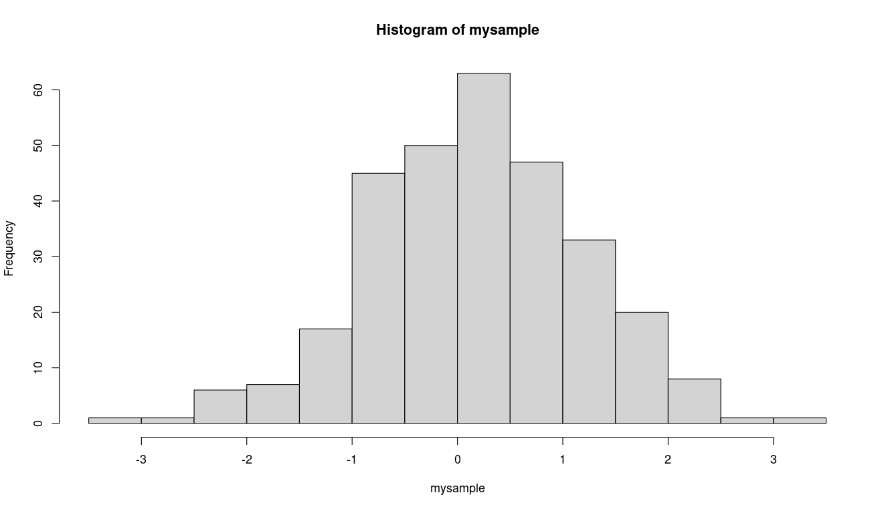

Let's look at our data in a much more useful way than a raw plot, using a histogram:

```

> mysample = rnorm(300)
> hist(mysample)

```
Here we create a sample of 300 values drawn from a normal distribution, and ask R to plot a histogram of this sample.  This results in a histogram that you see below:



We can adjust the number of bins in the histogram, using the optional parameter `breaks`.   For example, to use 30 bins instead of the default of 10, we can use the function call:

```

> hist(mysample, breaks=30)

```

And you get a graph that doesn't look so bell-shaped:


This just is what happens when the ratio of values to bins gets too low.
