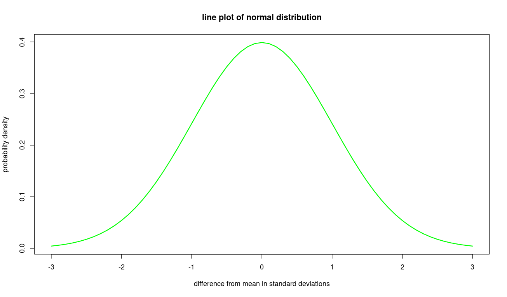

Line plots can be useful for visualizing time series data, cumulative frequency data, cumulative distribution functions or probability distribution functions.   For example, suppose we want to graph the distribution function of the standard normal distribution.  We can generate a set of input values where the normal distribution is significantly greater than zero as follows:

```
> zscores=seq(-3, 3, 0.1)

```
The `seq` function generates a sequence of values with a constant difference between consecutive values.  It takes 3 parameters:

* lowest value
* highest value
* step size - difference between consecutive values

We then get this R vector:

```

> zscores
 [1] -3.0 -2.9 -2.8 -2.7 -2.6 -2.5 -2.4 -2.3 -2.2 -2.1 -2.0 -1.9 -1.8 -1.7 -1.6 -1.5 -1.4
[18] -1.3 -1.2 -1.1 -1.0 -0.9 -0.8 -0.7 -0.6 -0.5 -0.4 -0.3 -0.2 -0.1  0.0  0.1  0.2  0.3
[35]  0.4  0.5  0.6  0.7  0.8  0.9  1.0  1.1  1.2  1.3  1.4  1.5  1.6  1.7  1.8  1.9  2.0
[52]  2.1  2.2  2.3  2.4  2.5  2.6  2.7  2.8  2.9  3.0

```

These will be the x-axis values in our line plot.  To plot this distribution function, we use the `dnorm` function.  We can apply it directly to the vector of input values without any loop programming in order to generate a vector of the resultant output values.  This will be our set of y-axis values.  We can then graph the normal distribution using this call:

```

> plot(zscores, dnorm(zscores), 
    type="l", 
    col="green", 
    lwd=2,
    main='line plot of normal distribution',
    xlab='difference from mean (standard deviations)',
    ylab='probability density')

```
You get:


