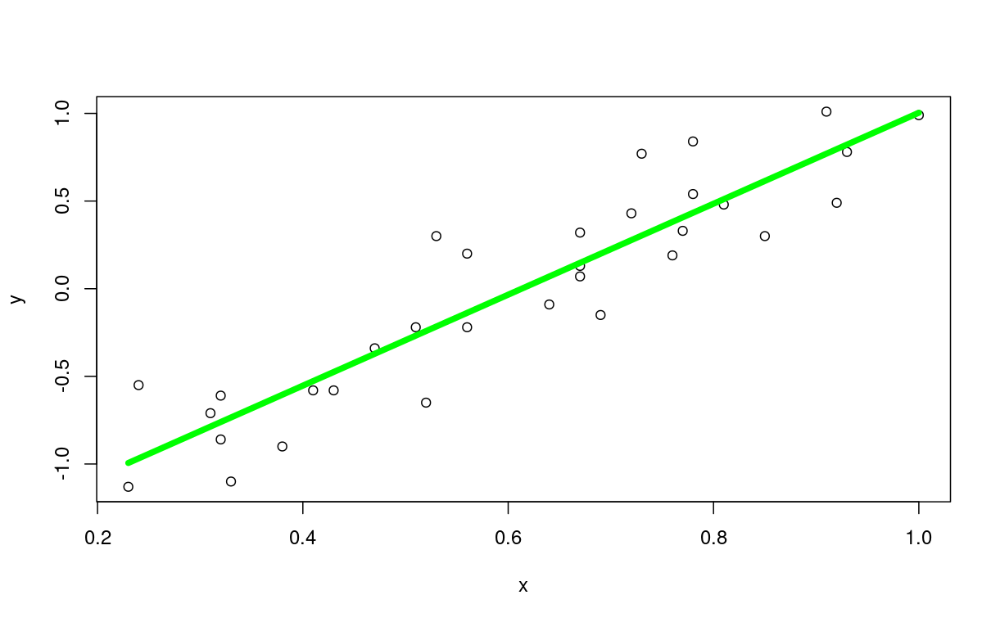
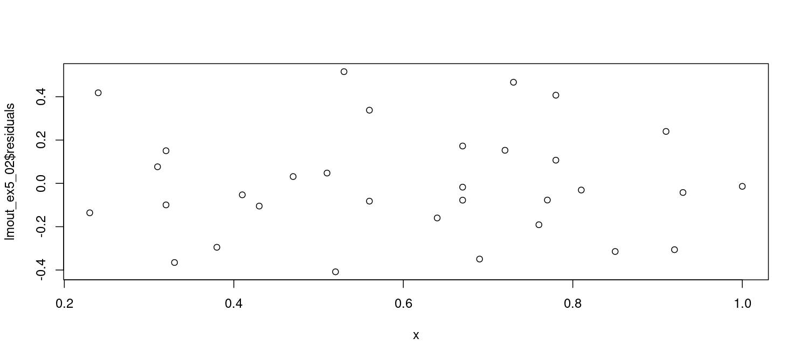

Here's how to do basic least-squares line fitting to a data set in R, using data from the example 5.6 (also from example 5.2) on textbook page 228, which shows relationship between wine taste and tannin concentration.  The data set is in [data_sets/ex5_02.txt](https://raw.githubusercontent.com/bengland2/une-stats/main/MAT150/data_sets/ex5_02.txt).   The scatterplot there shows that the 2 variables have potential for least-squares linear regression.   To compute a least-squares linear regression line for the data and graph it with the data, upload the file from ex5_02.txt to R Cloud Studio, then import the dataset to obtain data frame *ex5_02*, then:

```
> attach(ex5_02)
> lmout = lm(y ~ x)
> summary(lmout)
 
Call:
lm(formula = y ~ x)

Residuals:
     Min       1Q   Median       3Q      Max 
-0.40835 -0.14186 -0.03645  0.15111  0.51571 

Coefficients:
            Estimate Std. Error t value Pr(>|t|)    
(Intercept)  -1.5908     0.1339  -11.88 7.13e-13 ***
x             2.5946     0.2079   12.48 2.09e-13 ***
---
Signif. codes:  
0 ‘***’ 0.001 ‘**’ 0.01 ‘*’ 0.05 ‘.’ 0.1 ‘ ’ 1

Residual standard error: 0.253 on 30 degrees of freedom
Multiple R-squared:  0.8385,	Adjusted R-squared:  0.8331 
F-statistic: 155.7 on 1 and 30 DF,  p-value: 2.089e-13 

> lmout
Call:
lm(formula = y ~ x)

Coefficients:
(Intercept)            x  
     -1.591        2.595   

```

First we attach the data frame so we can refer to its columns directly.  For example, we can use *y* instead of *ex5_02$y*.  Then we call *lm* to do the LSLR (Least-Squares Linear Regression) calculations, and save the result in a variable named *lmout*.    The tilde character ("~") between the 2 columns in the lm() call is indicating that we are trying to predict the y-variable, perceived astringency (taste) as a linear function of the x-variable column, tannin concentration. If we display *lmout* directly we get the line coefficients (slope and y-intercept), but if we use *summary(Lmout)* then we get much more information, including the coefficient of determination, *r^2* , which tells us what fraction of the variation in the *y* variable is explained by the line.

To graphically display both the data and the LSLR line generated by *lm()*, we use these base R graphics calls:

```
> plot(x, y)
> lines(x, lmout$fitted.values, col="green", lwd=5)
```

The *plot* function displays the scatterplot of x and y raw data.

The *lines* function displays the LSLR line result.   Note that *lwd=5* widens the line (default *lwd=1*).   The green color is a little easier to see in my opinion.  

Note that both of these functions require the x "vector" (list of numbers) to be passed before the y vector.

And then you get:



For a simple, more intuitive derivation of the LSLR slope, see [this derivation](derivation-of-lslr-slope-simple.pdf) .

# residuals and coefficient of determination

If you want to visualize and quantify how good your LSLR line fits the data, you need residuals.  Using the `lmout` generated in previous section, you can get residuals from `lmout$residuals`.   Using these you can generate a residual plot showing residual value for each x-value in your sample:

```

plot(x, lmout$residuals,
 main='residual plot',
 xlab='x-value',
 ylab='residual for each x-value')
 
 ```
 and you get a graph like this:
 
 
 
This graph shows relatively small residuals spread randomly through the graph, which indicates a strong, linear relationship.

For a quantitative measure of the line fit, you can get the coefficient of determination from the `summary(lmout)` output where it mentions `r^2`, which is the symbol for the coefficient of determination.   This is a number between 0 and 1, with 1 being the best line fit.   We see a value of 0.8385, which means that 83.85% of the variation in y-values can be explained by the line, a good result.
 
# influential data

To determine if the observation is in fact influential, we assess whether removal of this observation has a large impact on the value of the slope or intercept of the least-squares line.

An observation is an outlier if it has a large residual. Outlier observations fall far away from the least-squares line in the y direction.  See textbook section 5.3 example 5.9 for an example of this.

