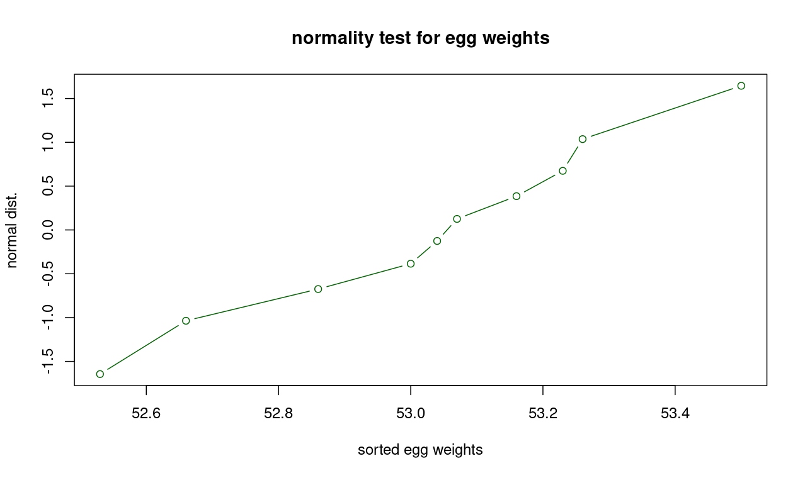
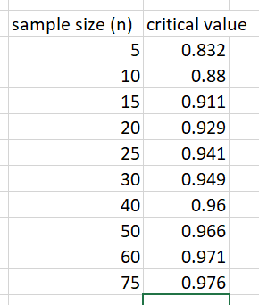

This section summarizes R functions for the normal distribution.  For all of these functions, there are optional parameters specifying the mean and standard deviation.  These optional parameters default to the standard normal distribution with mean of 0 and standard deviation of 1.

- pnorm(x, mean=0, sd=1, lower.tail=TRUE) - cumulative distribution function.  
- qnorm(p, mean=0, sd=1, lower.tail=TRUE) - inverse cumulative distribution function.   
- rnorm(n, mean=0, sd=1) - generate a n-value vector of values
- dnorm(x, mean=0, sd=1) - return the probability density for an x-value

lower.tail=FALSE will result in evaluating area under the curve to the right, rather than area under the curve to the left.  So `pnorm(x, lower.tail=FALSE)` is same as `1 - pnorm(x)` .

Additional help is available from R Studio in the "help" tab.

# comparing two sample proportions

To compare two samples with respect to proportion, we use the prop.test function [as described here in this r-bloggers page](https://www.r-bloggers.com/2022/05/two-sample-proportions-test-in-r-complete-guide)

# z-tests to compare two sample means

To compare two samples with respect to mean, we need a Z-test function *if the population proportion is known*.   To use this feature, you must install a R-language package called BSDA:

```

> install.packages('BSDA')
> library(BSDA)

```

Now you can look for help on the z.test function in the Help tab in the lower right pane.  The short version is:

`z.test(x1, x2, 
         alternative='two-sided', 
         mu=0, 
         sigma.x=NULL, 
         sigma.y=NULL, 
         conf.level=0.95)`

The sigma.x represents standard deviation *of the population from which x1 is randomly selected*, and the sigma y is the standard deviation *of the population from which x2 is randomly selected*.   If you don't know the population standard deviation, you are supposed to use the **t.test** function (described in the [t-distribution](t_distribution.md) page, but you might get away with using an estimate for the population standard deviation.  This function's arguments are very similar to the t.test function arguments, specifically mu, alternative and conf.level).   Note that the conf.level argument expresses it as a number between 0 and 1, not as a percentage.  

So for example, if you want to see if sample a is significantly greater than sample b, with a 90% confidence level, use:

```

> a = rnorm(10, mean=10, sd=1)
> b = rnorm(8, mean=11, sd=1)
> ztestout = z.test( a, b, alternative='less', conf.level=0.90)
Error in z.test(a, b, alternative = "less", conf.level = 0.9) : 
  You must enter values for both sigma.x and sigma.y
> ztestout = z.test( a, b, alternative='less', conf.level=0.90, sigma.x=1, sigma.y=1)
> ztestout

	Two-sample z-Test

data:  a and b
z = -2.5707, p-value = 0.005075
alternative hypothesis: true difference in means is less than 0
90 percent confidence interval:
         NA -0.3490975
sample estimates:
mean of x mean of y 
 10.31646  11.01261 


```

Here we generated the samples using rnorm(), so we know the population standard deviation of 1.  The results indicate that for these samples, we can reject the null hypothesis (based on p-value) and sample a is from a population that has a greater mean than sample b.   Similarly the confidence interval does not include zero, so this is further evidence that the null hypothesis can be rejected.   For more information, [consult this Statology webpage](https://www.statology.org/one-proportion-z-test-in-r/).

# normality test

To see if a sample or other vector of values is normally distributed, use the technique in textbook section 7.4.   In example 7.17, to generate normal z-scores for a sample of egg weights, use the R code below for `normal_zscores` .

```

egg_weights = c(53.04, 53.50, 52.53, 53.00, 53.07, 52.86, 52.66, 53.23, 53.26, 53.16)
sorted_egg_weights = sort(egg_weights)
inv_cdf_values = normal_zscores(length(egg_weights))
plot(sorted_egg_weights, inv_cdf_values, 
     col='darkgreen', 
     type='b', 
     main='normality test for egg weights', 
     ylab='normal dist.', 
     xlab='sorted egg weights')
r = cor(sorted_egg_weights, inv_cdf_values)

```
If the egg weights are normally distributed, then you should get a plot that is something like this:



And a correlation that is above the critical value in Table 7.1 for sample size 10, 0.880 (in this case, I got correlation r = 0.986).  

For R code to automate generating the `inv_cdf_values` value above using the `normal_zscores` function, see [normality_test.R](normality_test.R) .   To get and run the actual code:

- Click on the link above for the R code that I wrote to implement the method discussed in the slides for normality testing. 
- click on the `raw` button, which gets you the actual code text rather than formatting it for display
- copy-and-paste the 3 lines of code to your console and hit ENTER key
- You can now call this function just like any other R function

In the real world, [you would probably use a source code control system like git](https://git-scm.com/) to get this code into R, but for such a small amount of software, it's easier to just copy-and-paste it.

This code generates a set of percentiles.   For example, with the sample size 10 from the example above, we get:

```

> normal_zscores(10)
 [1] -1.6448536 -1.0364334 -0.6744898 -0.3853205 -0.1256613
 [6]  0.1256613  0.3853205  0.6744898  1.0364334  1.6448536

```
To understand where these numbers come from, the first 2 values in the returned vector are:

```

> qnorm(1/(2*10))
 [1] -1.6448536
> qnorm(3/(2*10))
 [1] -1.0364334

```
The plot of egg weights against these values is shown above.   We can use the `cor` function to calculate the linear correlation as well and use the table of critical values for that to decide if this is a normal distribution or not.


