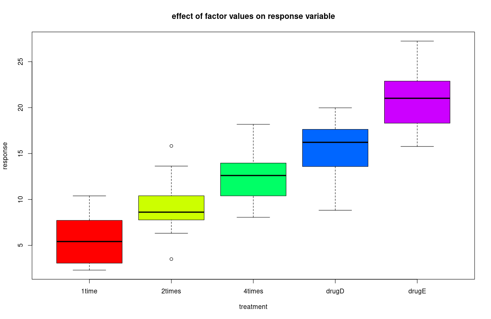
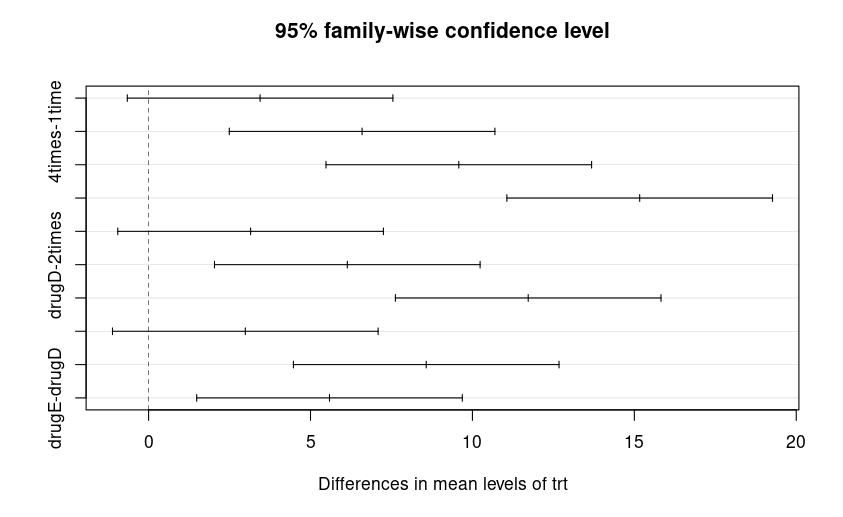
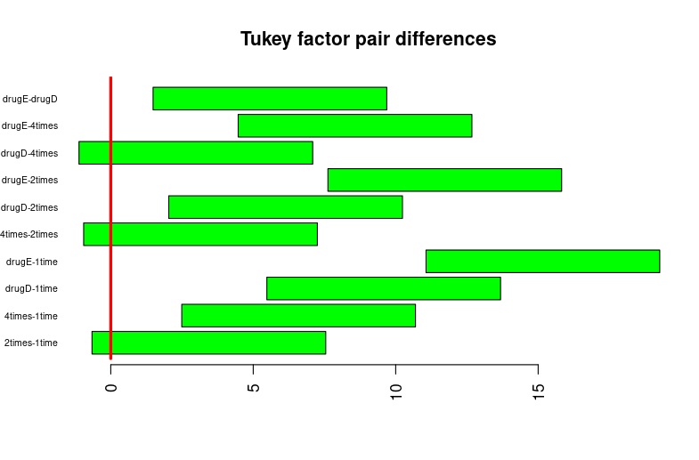

This document is based on the following article:

https://www.educba.com/anova-in-r/

With a couple of slight tweaks - we use the base R boxplot() function instead of other graphics.

First, to install:

```

> install.packages('multcomp')
> library(multcomp)
> str(cholesterol)
> attach(cholesterol)
> View(cholesterol)

```
At this point, you should have all the software you need and you should be able to see the data set and visualize the results.  Next, we do the preliminary ANOVA one-way factor analysis to see if there are any significant differences caused by the factor values.   In this case, the response variable is in the `response` data frame column, and the factor variable is in the `trt` (short for "treatment") column.   To do this first-stage analysis:

```

> aov_model <- aov(response ~ trt)
> summary(aov_model)
            Df Sum Sq Mean Sq F value   Pr(>F)    
trt          4 1351.4   337.8   32.43 9.82e-13 ***
Residuals   45  468.8    10.4                     
---
Signif. codes:  0 ‘***’ 0.001 ‘**’ 0.01 ‘*’ 0.05 ‘.’ 0.1 ‘ ’ 1

```
This tells us that there are 5 possible values in the `trt` column, hence degrees of freedom is 5-1 = 4.   There are 45 rows in the data frame, hence 45 residuals.   It gives us the intermediate calculations, an F-statistic, and a P-value that is very small, indicating that we should reject the null hypothesis that there are no significant differences caused by factor values.  To visualize this, we need only do:

```

boxplot(response ~ trt, 
        col=rainbow(5), 
        main='effect of factor values on response variable', 
        xlab='treatment')

```
To get this graph:



Next we do the Tukey algorithm to see which pairs of factor values have significantly different responses.

```

> TukeyHSD(aov_model)
  Tukey multiple comparisons of means
    95% family-wise confidence level

Fit: aov(formula = response ~ trt)

$trt
                  diff        lwr       upr     p adj
2times-1time   3.44300 -0.6582817  7.544282 0.1380949
4times-1time   6.59281  2.4915283 10.694092 0.0003542
drugD-1time    9.57920  5.4779183 13.680482 0.0000003
drugE-1time   15.16555 11.0642683 19.266832 0.0000000
4times-2times  3.14981 -0.9514717  7.251092 0.2050382
drugD-2times   6.13620  2.0349183 10.237482 0.0009611
drugE-2times  11.72255  7.6212683 15.823832 0.0000000
drugD-4times   2.98639 -1.1148917  7.087672 0.2512446
drugE-4times   8.57274  4.4714583 12.674022 0.0000037
drugE-drugD    5.58635  1.4850683  9.687632 0.0030633

```
So there were 5 choose 2 = 5!/(3!2!) = 10 possible pairs of values and all but 2 had significant differences.   The two that did not were (2times, 1time) and (4-times, 2-times) and (drugD-4times).    By looking at the boxplot, you can see the overlapping boxes in these cases, so these results seem sane.

But we would like to render the above table as a graph to make it easier to share and explain to other people.  The traditional solution is to wrap plot() around the TukeyHSD call, but this doesn't yield a good graph:



However, by using barplot() with some optional arguments, we can do better:

```

tukey_result_df = as.data.frame(tukey_result)
barplot(tukey_result_df$upr - tukey_result_df$lwr, 
        cex.names=0.6,
        col='green', 
        horiz=TRUE, 
        las=2, 
        names.arg=rownames(tukey_result$trt),
        offset=tukey_result_df$lwr, 
        main='Tukey factor pair differences' )
lines(c(0,0),c(0,100), col='red', lwd=3)

```

and now we get:



So that's an example of one-way ANOVA.    THere is much more to understand about ANOVA than what I've covered here but this at least gets the mechanics of running it in R out of the way.


