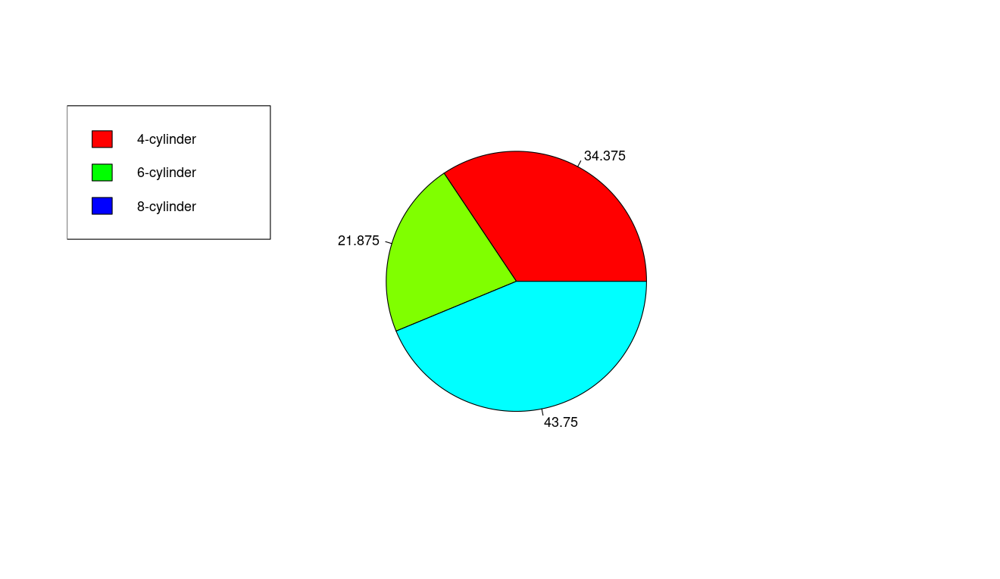

Typically a pie chart is used to display the relative fractions of a sample that fall into different categories.   
If the displayed data is not representing relative frequency of occurrence, then a pie chart is meaningless and will confuse the reader.
If there are too many slices of the pie (i.e. too many components to display), the chart becomes unreadable.  In this case you may be better off using a bar chart.

For example, using the mtcars dataset built into R, we could create a frequency table counting how many car models have various cylinders in the engine (e.g 4-cylinder, 6-cylinder).    To do this:

```

> cyl = count(mtcars$cyl)
> cyl$rel_freq_pct = cyl$freq * 100. / sum(cyl$freq)
> cyl
  x freq rel_freq_pct
1 4   11       34.375
2 6    7       21.875
3 8   14       43.750

```
So this table shows that out of all the 32 car models described in the mtcars data frame, 11 have 4 cylinders, 7 have 6 cylinders and 14 have 8 cylinders. To display a frequency table (or relative frequency table) as a pie chart:

```

> pie(cyl$rel_freq_pct, 
    labels=cyl$rel_freq_pct, 
    col=rainbow(cyl$x))
> legend("topleft", 
    legend=c('4-cylinder', '6-cylinder', '8-cylinder'), 
    fill=rainbow(length(cyl$x)))

```
We use "labels=" to display the numeric value next to the slice of pie.  And we overlay a legend on it to establish what the colors mean. We use the same color scheme that we use for the legend.   And we get:


