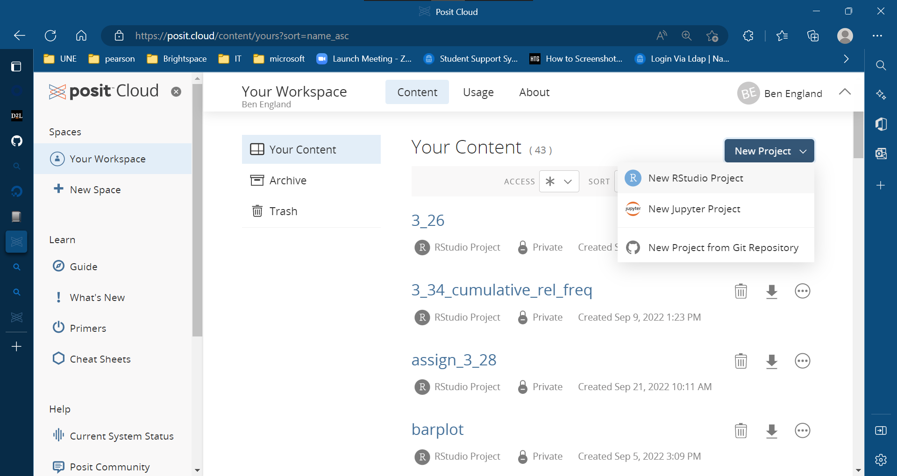
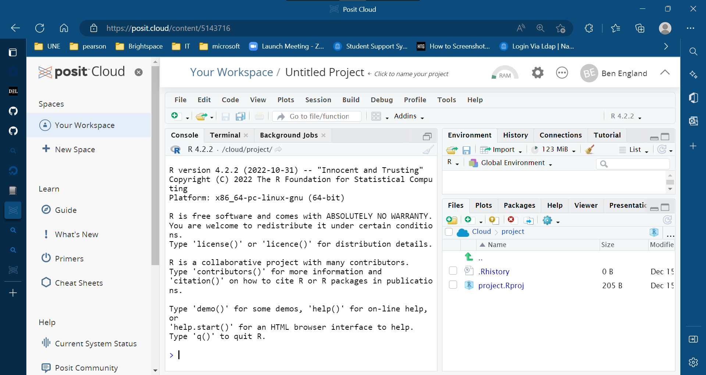

We use Posit Cloud Studio for the MAT150 Statistics course.  Advantages:

* it does not depend in any way upon the state of a student's laptop (you only need a standard browser and internet access).   
* software is already installed for you
* minimal access is free, but if you exceed the limits of the free account, you can upgrade to a $5/month account with much greater limuts

To set up, start by clicking on this URL.  We recommend the "Plus" plan for $5/month, which comes out to about $20 for the entire course.  

https://posit.cloud/plans/plus

But you can start out with the free plan and upgrade if this does not meet your needs.

https://posit.cloud/plans/free

You will have to enter an e-mail address, username and password at minimum.   Once you get an account, all the software you need for the course should already be installed - additional R packages can optionally be installed on top of your existing account should you need them.

Once you gain access to your account, you'll see a screen like this except there aren't any projects in it.   Click on the "New Project" button in the upper right corner, then select "New RStudio Project" from the menu to create a new project:

then assign it a name by typing in the field next to "Workspace".

You will then see an empty project that looks like this:

