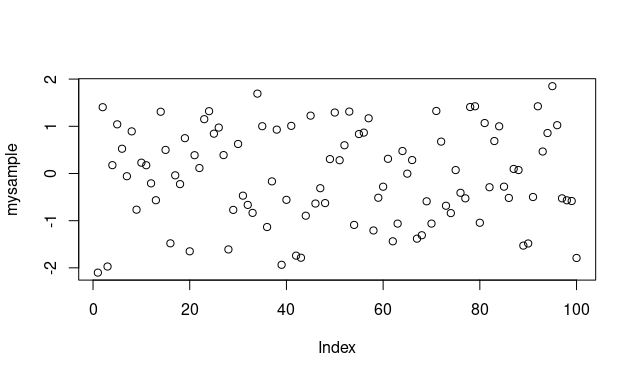

The simplest visualization of a list of values is the `plot` function called with a single vector.  For example:

```

> mysample = rnorm(100)
> plot(mysample)

```
This code generates a vector of 100 values generated from the standard normal distribution, and then plots the data.  
And you get this graph:



The Y-axis corresponds to the range of values in the vector, and the x-axis is the row of each value being displayed.     While this plot is easy to do, it is not that easy to look at or understand, just raw data in visual form.   However, it is already showing us that most of the values are between -1 and 1.   
