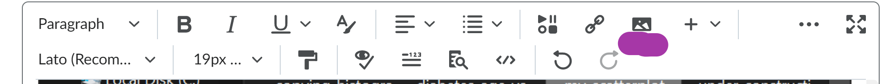

To save graphs and plots that you generate in R Cloud Studio, here is the most reliable method that I've seen - it turns out that copy-and-paste doesn't always have the desired effect.  This method of saving the plot to a file and then inserting it as a picture into your assignment should work more reliably.  

# export method 1 - export full-size graph

then hit the *Zoom* button in the lower right pane *Plots* tab to get an enlarged version of it in a separate window.  Then right-click (or 2 fingers on mouse pad) on the new window and select "Save as Image..." to save a **.png** file containing the image to your laptop, like this:

You can then attach this saved image file to your assignment if that is requested.

# export method 2 - export small graph

In the lower right pane's *Plots* tab, press *Export* and select *Save as Image...", as shown here:

# attach graph to brightspace assignment/quiz

Next, load the image into the editor used to enter your responses to the assignment using the insert-image button which looks like this - see purple underline in following figure.  That icon is supposed to look like a picture.

