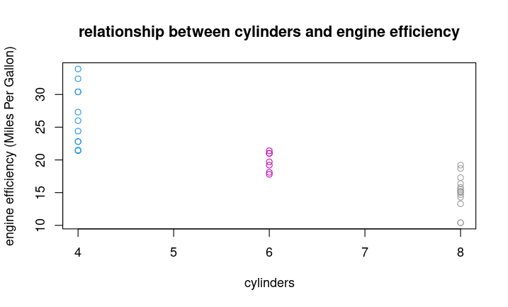

Scatterplots are critical for looking at relationship between parameters of a data set.   For example, in the `mtcars` data frame built into R, can we see any relationship between `mpg` and `cyl` columns ? 

```

> plot(mtcars$cyl, mtcars$mpg, 
       main="relationship between cylinders and engine efficiency", 
       xlab="cylinders", ylab="engine efficiency (Miles Per Gallon)", 
       col=mtcars$cyl)
       
```

We put the x-axis values first, the y-axis values second, followed by optional cosmetic parameters.  And you get this:


