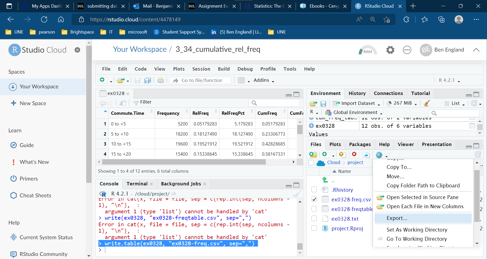

If you are asked to submit a table from R Cloud Studio as part of a homework assignment, here are instructions.

* build a data frame containing the table columns you need
* save the data frame to a file using write.table() as described below
* download the file to your computer as a .csv file
* view the .csv file in Excel to verify its contents are readable
* upload the .csv file to your assignment submission in Brightspace using "Add a file"

# writing table as a .csv file
You can save the table as a  .csv file inside R Cloud Studio using a function call like this one - change data frame name and filename for the problem you are doing.

```
write.table(ex0328, "ex0328-freq.csv", sep=",")

```

# download file to your computer

After you do this, go to the lower right pane and click on the Files tab -- you should see the file you just created.  Click on the gear icon and select "Export..." from the menu, as shown here:



You should then be able to specify a directory and download it.
