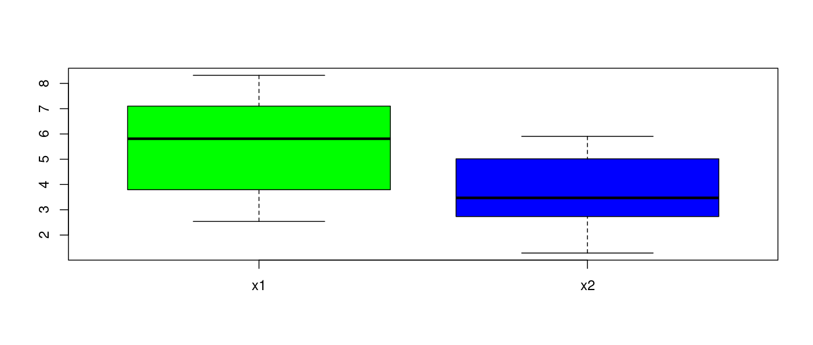
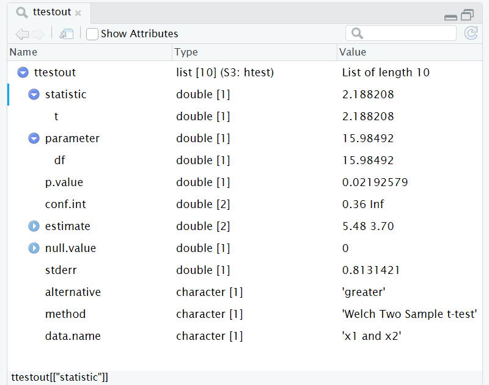

Here are the 4 functions for calculating with the T distribution in R:

- **pt(x, deg_freedom, lower.tail=TRUE)** - return cumulative distribution function (CDF) of x
- **qt(probability, deg_freedom, lower.tail=TRUE)** - inverse CDF - convert probability p to x coordinate A such that P(x < A) = p
- **dt(x, deg_freedom)** - calculate probability density at x
- **rt(n, deg_freedom)** - generate a sample of n values from the T distribution

lower.tail=FALSE will result in evaluating area under the curve to the right, rather than area under the curve to the left. So pt(x, 4, lower.tail=FALSE) is same as 1 - pt(x,4)

# how to visualize difference between 2 samples using R

For example, here are 2 samples that are normally distributed with significant overlap between their normal distributions:

```

> x1 = rnorm(10, mean=5, sd=2)
> x2 = rnorm(8, mean=4, sd=2)
> x1
 [1] 5.405350 6.719937 8.319649 7.114796 3.793384 7.102284
 [7] 3.934157 2.537202 3.685734 6.216136
> x2
[1] 1.288246 5.448981 3.469868 4.580849 3.470995 2.363848
[7] 3.100494 5.905032

```
If we want to see how these samples compare, just call boxplot(), only do it with 2 samples instead of 1.  :

```

> boxplot(x1, x2, col=c("green", "blue"), names=c('x1', 'x2'))

```
The optional argument "col" is not required, but is nice eye-candy.  You then get a boxplot like this:



# how to do T-test using R

But can we answer the question about whether there is a significant difference between the means of the two populations represented by our two samples?  We can use the t.test function to do this.  We need to identify the alternative hypothesis that we are testing first.  The simplest form of the t-test looks like this:

```

> ttestout = t.test(x1, x2)
> ttestout

	Welch Two Sample t-test

data:  x1 and x2
t = 2.1882, df = 15.985, p-value = 0.04385
alternative hypothesis: true difference in means is not equal to 0
95 percent confidence interval:
 0.05540736 3.50324003
sample estimates:
mean of x mean of y 
 5.482863  3.703539 

```

There are two outputs from this t-test:

- confidence interval
- hypothesis test result

Note that if you do not specify the alternative hypothesis, it defaults to the hypothesis that the difference in population means is not equal to 0.  The p-value in this case is just barely below the significance level, so there is some evidence that the two population means are not equal.  The confidence interval's lower bound is just slightly greater than zero, indicating some weak evidence that the two population means are not equal.

To see options for the alternative hypothesis:

```

> ttestout = t.test(x1, x2, alternative='help')
Error in match.arg(alternative) : 
  'arg' should be one of “two.sided”, “less”, “greater”
  
```

So this means we have 3 possible values for this optional parameter that defines the alternative hypothesis:

- two.sided (default) - alternative hypothesis is that the two population means are different
- less - alternative hypothesis is that population mean for x1 is < population mean for x2
- greater - alternative hypothesis is that population mean for x1 is > population mean for x2

Let's go with "greater" first, since this is what we expect (we generated the samples so that mean(x1) > mean(x2).  

```

> ttestout = t.test(x1, x2, alternative='greater')
> ttestout

	Welch Two Sample t-test

data:  x1 and x2
t = 2.1882, df = 15.985, p-value = 0.02193
alternative hypothesis: true difference in means is greater than 0
95 percent confidence interval:
 0.3595901       Inf
sample estimates:
mean of x mean of y 
 5.482863  3.703539 

```
What's different about this output from the first t.test call?

- p-value - this is different, as we would expect, because we are calculating 1 tail of the t-distribution instead of 2.
- alternative hypothesis: true difference in means is greater than 0
- confidence interval: "0.05540736 3.50324003" in first call, "0.3595901 Inf" in 2nd

The confidence interval difference is a little weird, because this should not depend on the alternative hypothesis, so I'm looking into this.

We can look at the results of the T-test by doing the command "View(ttestout)" and we get:



The p-value is 0.02.  If we are using a 95% confidence level for our hypothesis test, the significance level is 0.05.  Since the p-value is less than the significance level, we conclude that the null hypothesis is improbable, and therefore the alternative hypothesis that the population for sample x1 has a mean significantly greater than the population for sample x2.  However, if we were using a 99% confidence level, then this would not be the case.

The confidence level is [0.3595901, Inf] where "Inf" means infinity.   Note that the value 0 is not in the confidence interval, which is another way of saying that x2 is significantly greater than x1 for this confidence level.

Now let's try the alternative hypothesis of x1 < x2:

```

> ttestout

	Welch Two Sample t-test

data:  x1 and x2
t = 2.1882, df = 15.985, p-value = 0.9781
alternative hypothesis: true difference in means is less than 0
95 percent confidence interval:
     -Inf 3.199057

```
The hypothesis test results in a p-value of 0.98, much larger than a significance of 0.05 (95% confidence level), which means that we cannot reject the null hypothesis, so there is no evidence to show that the population from which sample x1 is drawn has a mean significantly less than the mean for the population from which sample x2 is drawn.

The confidence interval does include 0, which means we can't rule out that the two samples could be the same.  

## T-tests where difference is specified to be non-zero

The optional parameter `mu` allows us to specify a non-zero difference of the two means for the null hypothesis.   If we do not specify `mu`, the default is zero.  For example, suppose we want to test if sample 2 mean exceeds sample 1 mean by > 5.    We can use this call:

```

> t.test(x1, x2, mu=5, alternative='greater')

	Welch Two Sample t-test

data:  x1 and x2
t = -3.9608, df = 15.985, p-value = 0.9994
alternative hypothesis: true difference in means is greater than 5
...

```

Clearly there is no evidence for this claim - the p-value is nearly 1.  But if we change the mu to a lower value instead, we get:

```

 > t.test(x1, x2, mu=-1, alternative='greater')

	Welch Two Sample t-test

data:  x1 and x2
t = 3.418, df = 15.985, p-value = 0.001764
alternative hypothesis: true difference in means is greater than -1
...

```
And now we see that there is a very low p-value, meaning that the alternative hypothesis is highly likely.   

# paired T-tests

Let's just create a new sample, x3 with the same length as x2, and imagine that the conditions for a paired T-test were met with x2 and x3, and that we expect x3 to be significantly larger than x2.

```

> x3 = rnorm(length(x2), mean=10, sd=2)
> x3
[1] 10.647742 10.807093  7.189095  7.150805  8.644117
[6] 11.237735  6.744535 12.560927

```
We now can do a paired T-test in 2 ways:

```

> x2_minus_x3 = x2 - x3
> ttest(x2_minus_x3, alternative='less')

	One Sample t-test

data:  x2_minus_x3
t = -6.4913, df = 7, p-value = 0.0001684
alternative hypothesis: true mean is less than 0
95 percent confidence interval:
      -Inf -4.014582
sample estimates:
mean of x 
-5.669217 

```
This confirms that x3 is greater than x2 to almost any confidence level.  Or we could do the same thing with:

```

> t.test(x2, x3, paired=TRUE, alternative='less')

	Paired t-test

data:  x2 and x3
t = -6.4913, df = 7, p-value = 0.0001684
alternative hypothesis: true mean difference is less than 0
95 percent confidence interval:
      -Inf -4.014582
sample estimates:
mean difference 
      -5.669217 

```
Note that the p-value and t-statistic are identical.   With paired=TRUE argument, the t.test function does the vector subtraction for you.
