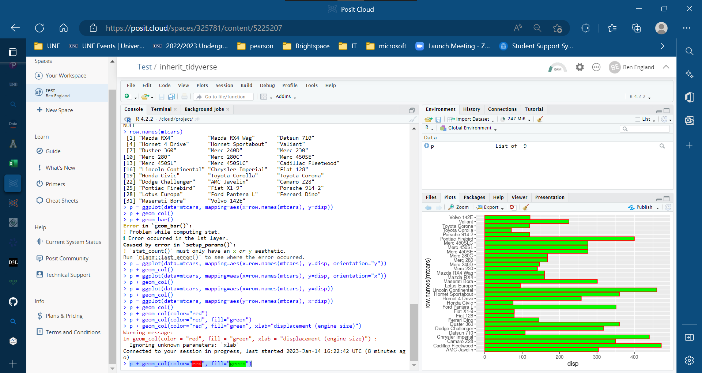

In order to get all the packages that you might need for this course, you need to follow this procedure, once.

* register with Posit Studio website to get an account (initially free, may be $5/month)
* login to your account on the website
* create a new workspace, name it tidyverse
* create a project named "base_tidyverse" in your workspace
** press "Create Project" button
** while project is being created, change the project name at the top by editing the name field
* in the R console, enter these commands:
```
install.packages("tidyverse")
library(tidyverse)
```
* click on gear icon in upper right and select "Access", make it "everyone"
* click on the workspace, click on gear icon for it
* set "Base RStudio project" field to "base_tidyverse"
* now click on your tidyverse workspace, click the new project button
* name the new project "test".  When it comes up...
* test it by doing:
```
p = ggplot(data=mtcars, mapping=aes(y=row.names(mtcars), x=disp))
p + geom_col(color="red", fill="green")
```
Without going into details, "mtcars" is a built-in R data frame, and "disp" is one of its columns.   The car names come from row.names(mtcars).  
You should see something like this:



